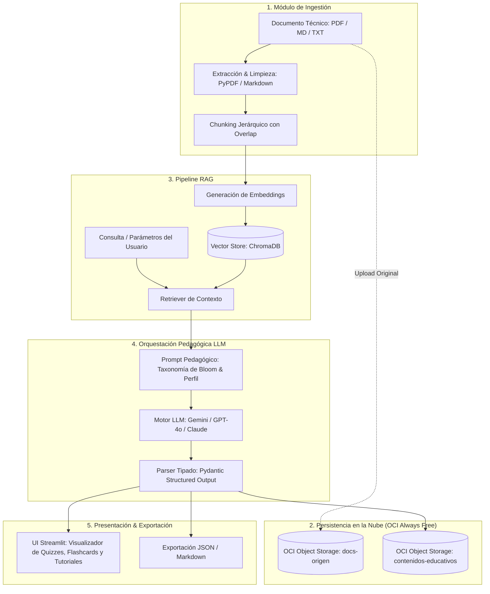

# 🎓 NuevaMente (NewMind) — Sistema Inteligente de Adaptación y Generación de Contenido Educativo

[](https://www.nocountry.tech/)
[](https://www.oracle.com/lad/education/oracle-next-education/)
[](https://www.python.org/)
[](https://www.oracle.com/cloud/free/)
[](https://streamlit.io/)

---

## 📌 Visión General
**NuevaMente** es una plataforma orientada al sector **EdTech y Capacitación Corporativa**. Utiliza técnicas de **Inteligencia Artificial Generativa y arquitectura RAG (Retrieval-Augmented Generation)** para transformar documentación técnica densa, manuales de software y artículos de arquitectura en contenidos educativos interactivos y personalizados.

El sistema garantiza un **anclaje estricto en las fuentes técnicas originales** para mitigar alucinaciones y persiste tanto los documentos originales como los paquetes pedagógicos estructurados en **Oracle Cloud Infrastructure (OCI) Object Storage** bajo la capa **Always Free**.

---

## 🏗️ Arquitectura Integral del Sistema



---

## 🎯 Criterios de Personalización Didáctica

- **Perfil del Destinatario:**
  - Principiante / Transición de Carrera (analogías cotidianas, pistas didácticas y lenguaje claro).
  - Desarrollador Junior / Semi Senior (ejemplos de implementación, sintaxis y buenas prácticas).
  - Líder Técnico / Arquitecto (trade-offs, patrones de diseño, resiliencia y seguridad).
  - Gestor / Ejecutivo No Técnico (impacto de negocio, ROI y resumen estratégico).
- **Formatos Pedagógicos de Salida:**
  - Guía Práctica Paso a Paso (Tutorial).
  - Flashcards de Memorización Activa (frente, dorso y pista didáctica).
  - Quiz Interactivo con retroalimentación y justificaciones pedagógicas.
  - Resumen Ejecutivo (TL;DR).
  - Guion de Clase / Video.
- **Nichos de Aplicación:** Fintech, Salud, E-commerce, Infraestructura Cloud y General.
- **Nivel de Detalle:** Didáctico, Técnico, Ejecutivo.

---

## 📋 Contrato de Datos Oficial (JSON Estructurado)

El pipeline implementa tipado estricto con **Pydantic** garantizando el esquema requerido por la rúbrica oficial de evaluación del Hackathon:

```json
{
  "status": "exito",
  "metadatos": {
    "perfil_aplicado": "Principiante",
    "formato_generado": "Flashcards",
    "tiempo_estimado_estudio_minutos": 5,
    "conceptos_clave": ["VCN", "Subredes", "Internet Gateway", "Security Lists"]
  },
  "contenido_adaptado": {
    "titulo": "Dominando Redes en la Nube (VCN) desde Cero",
    "introduccion_contextualizada": "Imagina la VCN como tu propio barrio privado dentro de la nube de Oracle...",
    "items": [
      {
        "frente": "¿Qué es una VCN en Oracle Cloud?",
        "dorso": "Es tu red virtual privada y personalizada dentro de la nube de Oracle...",
        "pista_didactica": "Piensa en ella como el terreno cercado donde residen tus servidores."
      }
    ]
  },
  "evaluacion_calidad": {
    "anclaje_fuente_score": 0.98,
    "claridad_pedagogica": "Alta",
    "observaciones": "Lenguaje ajustado con analogías para público principiante sin tecnicismos excesivos."
  },
  "almacenamiento_oci": {
    "bucket": "nuevamente-contenidos-educativos",
    "objeto_id": "contenido-vcn-principiante-flashcards-001.json",
    "status_upload": "completado"
  }
}
```

---

## 🐳 Inicio rápido con Docker

Solo necesitás Docker con Compose. La aplicación funciona sin credenciales externas gracias a los modos locales de LLM y almacenamiento.

```bash
git clone git@github.com:No-Country-simulation/G10-team1-newmind.git
cd G10-team1-newmind
docker compose up --build
```

Abrí `http://localhost:8501`. ChromaDB y el almacenamiento OCI emulado se conservan en volúmenes de Docker; no se requieren servicios de base de datos o caché adicionales.

Para usar un proveedor LLM real, copiá el ejemplo y completá al menos una API key antes de iniciar Compose:

```bash
cp .env.example .env
# Configurá GEMINI_API_KEY u OPENAI_API_KEY en .env
docker compose up --build
```

Para detener la aplicación usá `docker compose down`. Agregá `--volumes` únicamente si también querés borrar los datos locales persistidos.

---

## 🚀 Instalación y ejecución sin Docker

El flujo existente con un entorno virtual continúa disponible.

### 1. Clonar el Repositorio
```bash
git clone git@github.com:No-Country-simulation/G10-team1-newmind.git
cd G10-team1-newmind
```

### 2. Configurar Entorno Virtual y Dependencias
```bash
python3 -m venv venv
source venv/bin/activate
pip install -r requirements.txt
```

### 3. Configurar Variables de Entorno
```bash
cp .env.example .env
# Configura tus API Keys de LLM (Gemini / OpenAI) y credenciales de OCI Always Free
```

### 4. Iniciar la Aplicación Interactiva
```bash
./run_app.sh
# O alternativamente: streamlit run ui/app.py
```
Acceso en el navegador: `http://localhost:8501`

---

## 📚 Documentación de Gestión del Proyecto

- 📜 **[Plan de Gestión PRINCE2 / Project Brief](docs/PLAN_DE_GESTION_PRINCE2.md):** Metodología de gobierno democrático por 5 dimensiones, plan de Discord y ceremonias Daily.
- 📅 **[Estructura Desglosada de Trabajo (EDT en 5 Sprints)](docs/EDT_PLAN_DE_TRABAJO_5_SPRINTS.md):** Matriz WBS por áreas técnicas para las 5 semanas de la simulación.
- 📋 **[Entregable Oficial - Tarea 1 de No Country](docs/TAREA_1_DOCUMENTACION_PROYECTO_PRINCE2.md):** Documento preparado para la plataforma No Country en Markdown puro sin tablas.
- 📑 **[Requerimientos Oficiales del Hackathon ONE G10](docs/HACKATHON_ONE_G10_INDICACIONES.md):** Especificaciones técnicas, criterios de evaluación y ejemplos.

---

## 👥 Equipo del Proyecto (Hackathon ONE G10 — No Country)

- **Martin Morfe** — *Project Manager* (Coordinación General y Gobierno)
- **Esteban Guillermo Morales Velazquez** — *Software / Solution Architect* (Dimensión 1: Arquitectura Integral y RAG)
- **Juan David Villegas Anaya** — *Backend Developer* (Dimensión 2: Ingestión, Parsing y Datos)
- **Harol Benjamin Medina Zárate** — *Full Stack Developer* (Dimensión 3: Full Stack y Orquestación IA)
- **Heiner Jair Godoy Zamora** — *Full Stack Developer* (Dimensión 3: Full Stack y Orquestación IA)
- **Cristian Contreras** — *Frontend Developer* (Dimensión 4: Frontend y Experiencia de Usuario)
- **Diana Castaño** — *Frontend Developer* (Dimensión 4: Frontend y Componentes Didácticos)
- **Ivan Hernandez** — *DevOps Engineer* (Dimensión 5: OCI Always Free, Seguridad y QA)

---

## 📄 Licencia y Marco Social
Este proyecto es desarrollado como parte de la simulación laboral de **No Country** en el marco del programa social **Oracle Next Education (ONE)** y **Alura Latam**.
