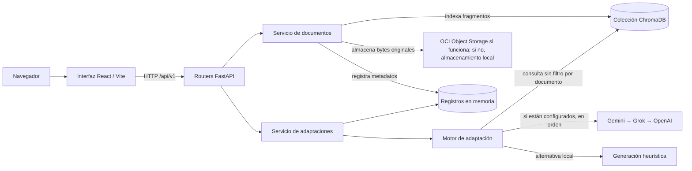
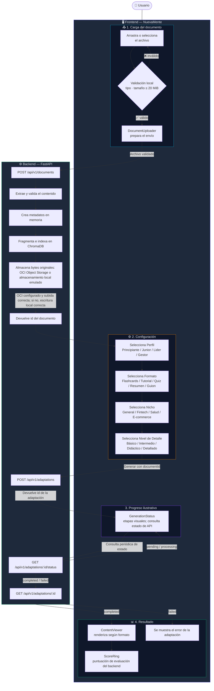

<h1 align="center">NuevaMente —  Sistema Inteligente de Adaptación y Generación de Contenido Educativo</h1>
<p align="center"><em>Documentos técnicos convertidos en materiales de aprendizaje adaptados</em></p>

<p align="center">
	
	
	
	
	
	
	
</p>

<p align="center">
  Proyecto desarrollado para el Hackathon Oracle Next Education (ONE) <br>
  Equipo #1 · G10-team1-newmind
</p>

---

## Descripción

NuevaMente transforma documentos técnicos en materiales educativos según el perfil destinatario, el formato, el sector y el nivel de detalle elegidos. La interfaz permite cargar el documento y consultar la adaptación generada por la API.

## Problema y solución

Un mismo documento técnico puede resultar difícil de estudiar cuando su lenguaje o presentación no se ajustan a quien lo lee. NuevaMente permite seleccionar destinatario, formato, sector y nivel de detalle; el backend recupera fragmentos relevantes de la colección indexada sin filtrar actualmente por el documento seleccionado y genera contenido con esa configuración. La puntuación de anclaje procede de la similitud de recuperación, no de una evaluación pedagógica independiente.

## Funcionalidades

| Área | Funcionalidad implementada |
| --- | --- |
| **Ingestión** | Carga y validación de PDF, Markdown y TXT de hasta 20 MiB; extracción de texto e indexación de fragmentos en ChromaDB. El original se almacena en OCI Object Storage cuando funciona o en almacenamiento local emulado. |
| **Adaptación** | Selección de perfil, formato, sector y nivel de detalle para un documento cargado. Un único motor recupera contexto de la colección indexada e intenta Gemini, Grok y OpenAI en ese orden, si están configurados; si no obtiene una respuesta válida, utiliza la alternativa heurística local. |
| **Consulta e historial** | Consulta periódica del estado, visualización del resultado o error e historial de adaptaciones. El panel calcula estadísticas y adaptaciones recientes desde listas de la API; las tarjetas de ejemplos son estáticas. |

La animación de cinco etapas es ilustrativa: no recibe telemetría de agentes. No existe un grafo multiagente ni un ciclo de regeneración por un agente crítico. Los metadatos de documentos y adaptaciones viven en memoria y se pierden al reiniciar el proceso. Consulte las [limitaciones del backend](./newmind-learning-backend/README.md#limitaciones-conocidas).

## Stack tecnológico

| Capa | Tecnologías utilizadas |
| --- | --- |
| Interfaz | React, Vite, Tailwind CSS y cliente HTTP para `/api/v1`. |
| API y procesamiento | Python, FastAPI, extracción de PDF/Markdown/TXT y servicios de aplicación. |
| Recuperación y generación | ChromaDB para fragmentos; intentos con Gemini, Grok y OpenAI si se configuran y responden correctamente, seguidos de una alternativa heurística local. La integración de Grok no acredita llamadas externas exitosas a xAI. |
| Almacenamiento del original | OCI Object Storage cuando funciona; almacenamiento local emulado en caso contrario. Metadatos de documentos y adaptaciones en memoria. |
| Ejecución local | Docker Compose para frontend y backend; perfil opcional de embeddings locales. |

## Arquitectura

La interfaz React/Vite llama a la API FastAPI mediante `/api/v1`; no accede directamente a los proveedores de generación ni al almacenamiento. Los routers de la API delegan en servicios de aplicación: el servicio de documentos usa ingestión, ChromaDB y almacenamiento del original; el de adaptaciones usa un motor que recupera contexto y genera contenido. Los registros de documentos y adaptaciones permanecen en memoria del proceso. La [arquitectura del backend](./newmind-learning-backend/ARCHITECTURE.md) detalla sus límites y dependencias.


```mermaid
flowchart LR
    Browser["Navegador"] --> UI["Interfaz React / Vite"]
    UI -->|"HTTP /api/v1"| API["Routers FastAPI"]
    API --> Docs["Servicio de documentos"]
    API --> Adapt["Servicio de adaptaciones"]
    Docs -->|"indexa fragmentos"| Chroma[("Colección ChromaDB")]
    Docs -->|"almacena bytes originales"| Storage["OCI Object Storage si funciona; si no, almacenamiento local"]
    Docs -->|"registra metadatos"| Records[("Registros en memoria")]
    Adapt --> Records
    Adapt --> Engine["Motor de adaptación"]
    Engine -->|"consulta sin filtro por documento"| Chroma
    Engine -->|"si están configurados, en orden"| Providers["Gemini → Grok → OpenAI"]
    Engine -->|"alternativa local"| Heuristic["Generación heurística"]
```

La selección depende de las claves configuradas y de que cada proveedor devuelva una respuesta válida; el diagrama no acredita llamadas externas exitosas.

## Flujo completo del sistema

La interfaz valida el archivo y lo envía a la API. El backend extrae y valida el contenido, crea metadatos en memoria, fragmenta e indexa el texto en ChromaDB y almacena los bytes del archivo original en OCI Object Storage si está configurado y la subida funciona, o en almacenamiento local emulado si no hay conexión o falla la subida. Solo tras almacenar el original devuelve el `id` del documento; si también falla la escritura local, la carga no devuelve un `id` válido. Los metadatos en memoria no se guardan de forma duradera en OCI y son distintos del índice de fragmentos de ChromaDB. Entonces el frontend envía ese `id` como `documentId` junto con los parámetros de adaptación. La API crea una adaptación y procesa el contenido en segundo plano. La página de resultados consulta periódicamente su estado y obtiene la adaptación completa cuando termina o falla; las etapas animadas representan el progreso de forma ilustrativa.

La respuesta de carga, listado y detalle incluye `filename` y `storage` (`mode`, `status`, `bucket`, `objectId`, `etag`, `errorCode`). `local_emulation` no prueba persistencia remota; `oci`/`completed` registra una escritura respondida por OCI, pero requiere lectura independiente para verificar el objeto. Consulte los [estados de almacenamiento del backend](./newmind-learning-backend/README.md#evidencia-de-almacenamiento-de-originales-clo-02).


```mermaid
flowchart TD
    U(["👤 Usuario"])

    subgraph FRONTEND["🖥️ Frontend — NuevaMente"]
        direction TB

        subgraph UPLOAD["📤 1. Carga del documento"]
            F1["Arrastra o selecciona\nel archivo"]
            F2{"Validación local\ntipo · tamaño ≤ 20 MiB"}
            F3["DocumentUploader\nprepara el envío"]
        end

        subgraph CONFIG["⚙️ 2. Configuración"]
            F4["Selecciona Perfil\nPrincipiante / Junior / Lider / Gestor"]
            F5["Selecciona Formato\nFlashcards / Tutorial / Quiz / Resumen / Guion"]
            F6["Selecciona Nicho\nGeneral / Fintech / Salud / E-commerce"]
            F7["Selecciona Nivel de Detalle\nBásico / Intermedio / Didáctico / Detallado"]
        end

        subgraph PIPELINE["3. Progreso ilustrativo"]
            F8["GenerationStatus\netapas visuales; consulta estado de API"]
        end

        subgraph RESULT["📊 4. Resultado"]
            F9["ContentViewer\nrenderiza según formato"]
            F10["ScoreRing\npuntuación de evaluación del backend"]
            F11["Se muestra el error de la adaptación"]
        end
    end

    subgraph BACKEND["⚙️ Backend — FastAPI"]
        B1["POST /api/v1/documents"]
        B5["Extrae y valida el contenido"]
        B6["Crea metadatos en memoria"]
        B7["Fragmenta e indexa en ChromaDB"]
        B8["Almacena bytes originales: OCI Object Storage o almacenamiento local emulado"]
        B9["Devuelve id del documento"]
        B2["POST /api/v1/adaptations"]
        B3["GET /api/v1/adaptations/:id/status"]
        B4["GET /api/v1/adaptations/:id"]
    end

    U --> F1
    F1 --> F2
    F2 -->|"✅ válido"| F3
    F2 -->|"❌ inválido"| F1
    F3 -->|"Archivo validado"| B1
    B1 --> B5 --> B6 --> B7 --> B8
    B8 -->|"OCI configurado y subida correcta; si no, escritura local correcta"| B9
    B9 --> F4
    F4 --> F5 --> F6 --> F7
    F7 -->|"Generar con documentId"| B2
    B2 -->|"Devuelve id de la adaptación"| F8
    F8 -->|"Consulta periódica de estado"| B3
    B3 -->|"pending / processing"| F8
    B3 -->|"completed / failed"| B4
    B4 -->|"completed"| F9
    B4 -->|"failed"| F11
    F9 --> F10

    style FRONTEND fill:#1e293b,stroke:#4f46e5,color:#e2e8f0
    style BACKEND fill:#1e293b,stroke:#059669,color:#e2e8f0
    style UPLOAD fill:#0f172a,stroke:#0891b2,color:#e2e8f0
    style CONFIG fill:#0f172a,stroke:#d97706,color:#e2e8f0
    style PIPELINE fill:#0f172a,stroke:#7c3aed,color:#e2e8f0
    style RESULT fill:#0f172a,stroke:#059669,color:#e2e8f0
```

## Estructura del proyecto

```text
./
├── newmind-learning-frontend/  # Interfaz React/Vite y cliente HTTP
├── newmind-learning-backend/   # API FastAPI, ingestión, recuperación y generación
├── docs/                       # Documentación institucional e índice
└── docker-compose.yml          # Servicios de desarrollo local
```

Consulte las guías de [frontend](./newmind-learning-frontend/README.md), [backend](./newmind-learning-backend/README.md), el [índice institucional](./docs/README.md) y la [configuración de Compose](./docker-compose.yml). Para ejecutar cada servicio sin Docker, consulte las guías de [backend](./newmind-learning-backend/README.md#inicio-rápido-local) y [frontend](./newmind-learning-frontend/README.md#-instalación-y-arranque). La configuración con Docker se explica [a continuación](#inicio-rápido-con-docker).

## Documentación y equipo

- [Indicaciones del Hackathon ONE G10](./docs/HACKATHON_ONE_G10_INDICACIONES.md): requisitos y alcance, revisados según la implementación actual.
- [Entregables de No Country](./docs/ENTREGABLES_NO_COUNTRY.md): entregables previstos y verificaciones pendientes.
- [Plan de gestión PRINCE2](./docs/PLAN_DE_GESTION_PRINCE2.md): planificación y riesgos; no certifica ejecución ni asignaciones vigentes.
- [EDT y plan de cinco sprints](./docs/EDT_PLAN_DE_TRABAJO_5_SPRINTS.md): tareas planificadas, no constancia de conclusión.

Los documentos recuperados mencionan personas y responsabilidades de una planificación anterior; este repositorio no permite confirmar sus asignaciones actuales. Antes de publicar un equipo o atribuir entregables, deben confirmarse con sus integrantes. El [índice institucional](./docs/README.md) explica el origen y las revisiones de estos documentos.

## Inicio rápido con Docker

Este flujo es únicamente para desarrollo local; no representa una configuración lista para producción.

Desde la raíz del repositorio, ejecute el conjunto de servicios:

```bash
docker compose up --build app frontend
```

Los servicios quedan disponibles en:

| Servicio | URL |
| --- | --- |
| Frontend | `http://localhost:5173` |
| Backend | `http://localhost:8000` |
| Salud del backend | `http://localhost:8000/health` |

### Iniciar cada servicio por separado

Todos los comandos se ejecutan desde la raíz del repositorio.

Solo backend:

```bash
docker compose up --build app
```

Solo frontend:

```bash
docker compose up --build frontend
```

Cada servicio usa su propio contexto e imagen:

| Servicio | Contexto de construcción | Imagen local |
| --- | --- | --- |
| `app` | `./newmind-learning-backend` | `newmind-learning-backend:local` |
| `frontend` | `./newmind-learning-frontend` | `newmind-learning-frontend:local` |

El frontend recibe `VITE_API_URL=http://localhost:8000`. Vite expone esa variable al código que se ejecuta en el navegador, por lo que la URL debe ser accesible desde el host. El nombre DNS `app` solo se resuelve dentro de la red de Compose y el navegador no puede usarlo.

> Los flujos de carga, adaptación, resultado, historial y estadísticas del panel consultan la API; las tarjetas de ejemplos y las etapas animadas son ilustrativas. Iniciar los servicios no reemplaza una prueba funcional de extremo a extremo.

Para detener los contenedores sin borrar datos persistidos:

```bash
docker compose down
```

Para detenerlos y borrar también los volúmenes locales de desarrollo:

```bash
docker compose down --volumes
```

## Variables de entorno

El backend puede ejecutarse sin credenciales externas usando los modos locales/emulados. Para usar proveedores reales, copie el ejemplo del backend y complete las claves necesarias:

```bash
cp newmind-learning-backend/.env.example .env
```

Variables principales:

| Variable | Uso |
| --- | --- |
| `GEMINI_API_KEY` | API key opcional para Gemini. |
| `GROK_API_KEY` | Clave opcional leída por la configuración y el motor para intentar Grok después de Gemini y antes de OpenAI; no implica que se haya realizado una llamada externa exitosa. |
| `OPENAI_API_KEY` | API key opcional para OpenAI. |
| `ANTHROPIC_API_KEY` | Clave declarada para Anthropic; el motor actual no implementa este proveedor. |
| `APP_ENV` | Entorno de ejecución; por defecto `development`. |
| `LOG_LEVEL` | Nivel de logging; por defecto `INFO`. |
| `BACKEND_HOST` | Host interno del entrypoint backend; por defecto `0.0.0.0`. |
| `BACKEND_PORT` | Puerto interno del entrypoint backend; por defecto `8000`. |
| `VITE_API_URL` | URL del backend accesible desde el navegador; en el entorno Docker local usa `http://localhost:8000`. |

### OCI Object Storage real con Docker Compose

Para usar OCI real en Docker local, cada desarrollador debe configurar sus propios secretos fuera de Git. No comparta ni suba archivos `.env`, `docker-compose.override.yml`, OCID reales, huellas, espacios de nombres reales ni claves privadas.

#### Identidad recomendada

- Para desarrollo local, cada desarrollador debe usar su propio usuario OCI, pertenecer al grupo `grp-nuevamente-storage` y generar su propia API key. Esto mantiene trazabilidad y evita compartir claves privadas.
- Para entornos de ejecución, preproducción, producción o CI/CD, utilice una identidad técnica dedicada al backend, por ejemplo `svc-nuevamente-storage`, con los mismos permisos mínimos requeridos.
- No comparta un PEM entre desarrolladores. Si esa clave se filtra, habría que rotarla para todo el equipo y se pierde trazabilidad de acciones.

1. Cree un `.env` en la raíz del repositorio con valores reales locales:

   ```env
   OCI_USER_OCID=
   OCI_FINGERPRINT=
   OCI_TENANCY_OCID=
   OCI_REGION=mx-queretaro-1
   OCI_KEY_FILE=/run/secrets/oci_api_key.pem
   OCI_OBJECT_STORAGE_NAMESPACE=
   OCI_BUCKET_DOCS=nuevamente-documentos-origen
   OCI_BUCKET_OUTPUTS=nuevamente-contenidos-educativos
   OCI_COMPARTMENT_ID=
   ```

2. Copie el archivo de sustitución de ejemplo y apúntelo a su clave privada local:

   ```bash
   cp docker-compose.override.example.yml docker-compose.override.yml
   ```

   En Windows/PowerShell puede definir la ruta del PEM antes de levantar Compose:

   ```powershell
   $Env:OCI_PRIVATE_KEY_HOST_PATH="$Env:USERPROFILE\.oci\oci_api_key.pem"
   ```

   También puede reemplazar manualmente el lado izquierdo del volumen en `docker-compose.override.yml`. El lado derecho debe mantenerse igual porque es la ruta que usa el contenedor:

   ```text
   /run/secrets/oci_api_key.pem
   ```

3. Valide la configuración expandida sin pegar la salida completa en conversaciones o incidencias:

   ```bash
   docker compose config
   ```

   Debe aparecer el montaje hacia `/run/secrets/oci_api_key.pem`.

4. Inicie el backend y compruebe su estado de salud:

   ```bash
   docker compose up --build app
   curl http://localhost:8000/health
   ```

   Los indicadores de salud (`oci_mode`, `real_oci_ready` y `local_fallback`) muestran configuración y modo detectado, no verifican una operación remota. Para comprobar una carga concreta, consulte `storage` en la respuesta; incluso `oci`/`completed` requiere una lectura independiente del objeto.

> `OCI_CONFIG_FILE` y `OCI_CONFIG_PROFILE` siguen disponibles para ejecución local sin Docker, pero en Docker Compose se recomienda usar variables explícitas y montar solo el PEM como secreto de solo lectura. Un archivo de configuración local de OCI normalmente contiene rutas Windows que no existen dentro del contenedor Linux.

## Perfil opcional de embeddings locales

La imagen base del backend mantiene OCI y dependencias necesarias, pero no incluye PyTorch ni `sentence-transformers` para evitar una imagen base pesada.

Para construir la variante con embeddings locales CPU-only:

```bash
docker compose --profile embeddings build app-embeddings
```

Para levantar esa variante:

```bash
docker compose --profile embeddings up app-embeddings
```

La variante de embeddings queda disponible en:

```text
http://localhost:8001/health
```

## Verificaciones útiles

Validar la configuración base:

```bash
docker compose config
```

Validar la configuración con el perfil de embeddings:

```bash
docker compose --profile embeddings config
```

Ejecutar tests del backend dentro del contenedor:

```bash
docker run --rm newmind-learning-backend:local pytest
```
