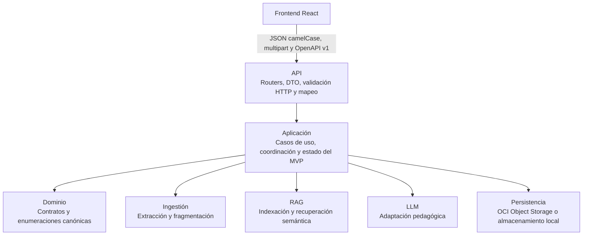

# Arquitectura del backend

NuevaMente expone una API REST contract-first con FastAPI y mantiene las capacidades de ingestión, RAG, generación y persistencia detrás de servicios de aplicación. Esta separación permite integrar el frontend React sin trasladar nombres de transporte al dominio ni exigir credenciales de nube durante el desarrollo local.

## Vista rápida

La regla de dependencias es **API → aplicación → dominio/capacidades → infraestructura**. Los módulos `ingestion/`, `rag/`, `llm/` y `storage/` no dependen de FastAPI ni de los DTO del frontend. `main.py` compone las dependencias, configura la aplicación y conserva el arranque en el puerto `8000`.

## Capas y responsabilidades

| Capa o módulo | Responsabilidad |
| --- | --- |
| `main.py` | Composición de la aplicación FastAPI, CORS, salud y ejecución con Uvicorn. |
| `api/` | Routers versionados, DTO Pydantic, códigos HTTP, errores y mapeo explícito API-dominio. |
| `application/` | Orquestación de carga y adaptación; repositorios en memoria protegidos para acceso concurrente. |
| `models/` | Modelos y enumeraciones canónicas del dominio, independientes del contrato HTTP. |
| `ingestion/` | Extracción de PDF, Markdown y texto; división determinista en fragmentos. |
| `rag/` | Indexación en ChromaDB y recuperación de contexto. |
| `llm/` | Prompts, selección de proveedor, generación y alternativa heurística sin conexión. |
| `storage/` | OCI Object Storage con almacenamiento local emulado cuando OCI no está disponible. |
| `config/` | Configuración centralizada desde variables de entorno y `.env`. |
| `tests/` | Pruebas de contrato HTTP, OpenAPI, mapeo, capacidades e integraciones locales. |

## Frontera contract-first y OpenAPI

Los modelos de `api/schemas.py` constituyen el contrato público. FastAPI los usa como `response_model` para validar y serializar las respuestas, y publica el contrato en `/openapi.json` y la interfaz interactiva en `/docs`.

El transporte conserva los nombres esperados por el frontend (`documentId`, `detailLevel`, `createdAt`, entre otros). El dominio conserva sus nombres y enumeraciones canónicas en español snake_case. `api/mappers.py` es la única frontera que traduce entre ambos modelos; no se incorporan campos de Axios o React a `models/`.

## Endpoints v1

| Método | Ruta | Resultado |
| --- | --- | --- |
| `GET` | `/health` | Estado del servicio, entorno y modo de almacenamiento. |
| `POST` | `/api/v1/documents` | Carga multipart de un documento; responde `201`. |
| `GET` | `/api/v1/documents` | Lista de documentos cargados. |
| `GET` | `/api/v1/documents/{id}` | Documento por identificador o `404`. |
| `DELETE` | `/api/v1/documents/{id}` | Elimina el documento del estado del MVP; responde `204` o `404`. |
| `POST` | `/api/v1/adaptations` | Crea un trabajo y responde `202` con identificador y estado inicial. |
| `GET` | `/api/v1/adaptations` | Lista trabajos; admite filtros opcionales `profile`, `format` y `status`. |
| `GET` | `/api/v1/adaptations/{id}` | Estado y resultado completo de una adaptación. |
| `GET` | `/api/v1/adaptations/{id}/status` | Respuesta mínima para sondeo del estado. |

Las cargas aceptan exclusivamente `.pdf`, `.md` y `.txt`, con un máximo de 20 MB. El backend normaliza el nombre recibido, elimina componentes de ruta y rechaza archivos vacíos, tipos no admitidos o contenido no extraíble mediante errores HTTP claros.

## Flujo asíncrono de adaptación

1. El cliente envía el DTO camelCase a `POST /api/v1/adaptations`.
2. La API comprueba que `documentId` exista; si no existe, responde `404`.
3. El mapeador crea una `SolicitudAdaptacion` con valores canónicos del dominio.
4. La aplicación registra el trabajo como `pending` y la API responde `202` inmediatamente.
5. `BackgroundTasks` cambia el trabajo a `processing` y ejecuta RAG, LLM y persistencia fuera del ciclo de respuesta.
6. El trabajo termina como `completed` con contenido y evaluación, o como `failed` con el error.
7. El frontend consulta periódicamente `GET /api/v1/adaptations/{id}/status` y obtiene el resultado completo cuando finaliza.

`BackgroundTasks` es suficiente para el MVP, pero no ofrece reintentos durables ni ejecución distribuida. Una evolución productiva debe reemplazarlo por una cola de trabajos con workers sin modificar el contrato HTTP.

## Mapeo API a dominio

| Campo | Valores de la API | Valor canónico de dominio |
| --- | --- | --- |
| `profile` | `Principiante` | `Principiante` |
| `profile` | `Junior`, `Senior` | `Desarrollador Junior / Semi Senior` |
| `profile` | `Lider` | `Líder Técnico / Arquitecto` |
| `profile` | `Gestor` | `Gestor / Ejecutivo (No Técnico)` |
| `format` | `Flashcards`, `Tutorial`, `Quiz`, `Resumen Ejecutivo`, `Guion` | Enumeración `FormatoSalida` equivalente y canónica. |
| `industry` | `Fintech`, `Salud`, `E-commerce`, `General` | Enumeración `NichoSector` equivalente. |
| `detailLevel` | `Basico`, `Didactico` | `Didactico` |
| `detailLevel` | `Intermedio`, `Detallado` | `Tecnico` |

Las respuestas vuelven a utilizar los valores originales del contrato de frontend. Así, los filtros y la presentación permanecen estables aunque las etiquetas internas sean más descriptivas.

## Configuración, CORS e integraciones

- `CORS_ORIGINS` acepta una lista separada por comas y su valor predeterminado es `http://localhost:5173`.
- `BACKEND_HOST` y `BACKEND_PORT` controlan el servidor; el puerto predeterminado es `8000` para conservar compatibilidad con Docker y `VITE_API_URL`.
- Las credenciales de Gemini, OpenAI y OCI se leen exclusivamente desde configuración del backend.
- Sin credenciales OCI, `storage/` usa `data/oci_local_storage/`.
- Sin proveedor LLM disponible, `llm/` conserva el generador heurístico local.
- ChromaDB persiste sus datos bajo el directorio configurado por `CHROMA_PERSIST_DIR`.

## Estado del MVP y evolución

Los metadatos de documentos y adaptaciones se almacenan en repositorios en memoria con bloqueo para acceso concurrente. Por lo tanto:

- los identificadores, estados y resultados se pierden al reiniciar el proceso;
- varias réplicas no comparten estado;
- eliminar un documento retira su registro del API, pero la limpieza física de objetos y vectores queda pendiente;
- `BackgroundTasks` no recupera trabajos interrumpidos.

La siguiente evolución debe introducir repositorios persistentes mediante interfaces de aplicación: una base de datos para metadatos y estados, una cola durable para adaptaciones y operaciones explícitas de eliminación en ChromaDB y OCI. Las capacidades existentes pueden permanecer detrás de esos adaptadores.

## Reglas de diseño

1. Los routers se limitan a HTTP, validación y serialización.
2. La aplicación coordina casos de uso; no contiene detalles de FastAPI.
3. Los DTO de API y los modelos de dominio permanecen separados.
4. Las integraciones externas se consumen detrás de los servicios de aplicación.
5. El desarrollo y las pruebas no requieren credenciales de servicios de pago.
6. Todo endpoint nuevo debe declarar `response_model` y quedar cubierto por el contrato OpenAPI.
7. Las pruebas deben verificar tanto el camino correcto como los errores de frontera relevantes.
