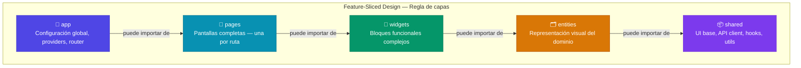
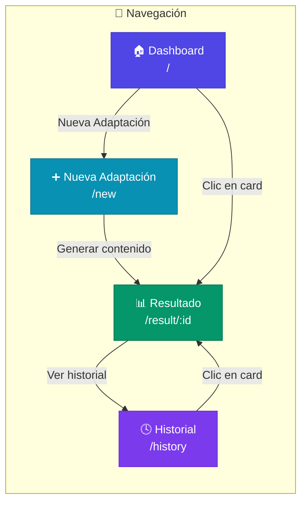
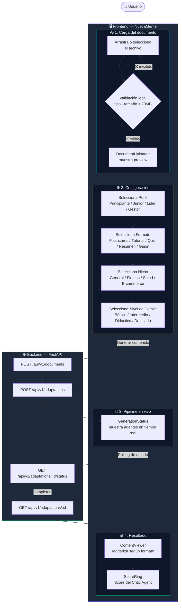
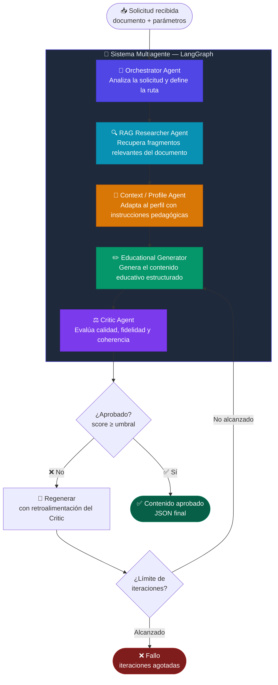
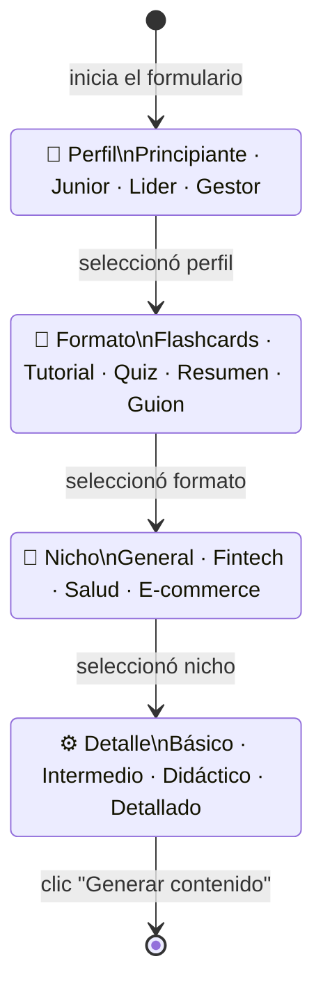
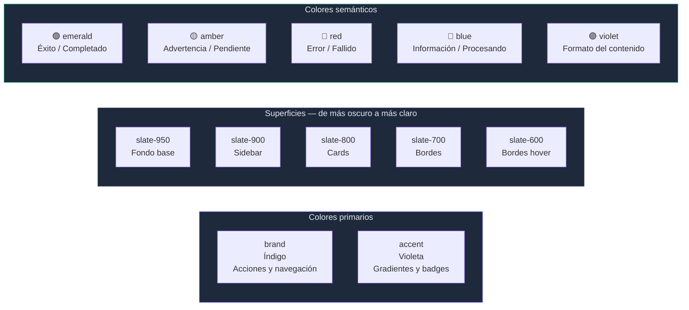

<div align="center">

# 🧠 NuevaMente — Frontend

**Sistema Inteligente de Adaptación y Generación de Contenido Educativo**

*Programa ONE · Grupo 10 · Proyecto 1*

<br/>

[](https://react.dev)
[](https://vitejs.dev)
[](https://tailwindcss.com)
[](https://reactrouter.com)
[](https://axios-http.com)

<br/>

> Interfaz visual del sistema NuevaMente.
> Permite cargar documentos técnicos, configurar la adaptación educativa
> y visualizar el contenido generado por el pipeline multiagente de IA.

<br/>

</div>

---

## 📋 Tabla de contenidos

- [📖 Descripción general](#-descripción-general)
- [🚀 Instalación y arranque](#-instalación-y-arranque)
- [🏗️ Arquitectura — Feature-Sliced Design](#️-arquitectura--feature-sliced-design)
- [📁 Estructura de carpetas](#-estructura-de-carpetas)
- [📺 Pantallas de la aplicación](#-pantallas-de-la-aplicación)
- [🔄 Flujo completo del sistema](#-flujo-completo-del-sistema)
- [🤖 Pipeline multiagente](#-pipeline-multiagente)
- [🧩 Widgets](#-widgets)
- [🗂️ Entities](#️-entities)
- [📦 Shared — código reutilizable](#-shared--código-reutilizable)
- [🔌 Conexión con el backend](#-conexión-con-el-backend)
- [📐 Convenciones de código](#-convenciones-de-código)
- [🎨 Sistema de diseño](#-sistema-de-diseño)

---

## 📖 Descripción general

NuevaMente transforma documentos técnicos en contenido educativo adaptado a distintos perfiles. El frontend es la capa de interfaz — no contiene lógica de IA.

<br/>

<table>
<tr>
<td width="50%" valign="top">

**✅ Responsabilidades del frontend**

- Cargar y validar documentos (PDF, MD, TXT)
- Recolectar la configuración de la adaptación
- Visualizar el pipeline de agentes en tiempo real
- Renderizar el contenido generado por formato
- Gestionar el historial de adaptaciones con filtros

</td>
<td width="50%" valign="top">

**❌ Lo que el frontend NO hace**

- No tiene lógica de IA ni modelos de lenguaje
- No se comunica con Gemini, ChromaDB ni PostgreSQL
- No accede al sistema de archivos directamente
- No conoce la implementación interna del backend

</td>
</tr>
</table>

> 💡 **Para desarrolladores nuevos:** el frontend funciona completamente con datos simulados sin necesidad de correr el backend. Ver [Conexión con el backend](#-conexión-con-el-backend).

---

## 🚀 Instalación y arranque

### Requisitos

- **Node.js** 22, o una versión compatible con Vite 8: `^20.19.0 || >=22.12.0`
- **npm** 9 o superior

### Pasos

```bash
# 1. Clonar el repositorio (si no lo tenés)
git clone https://github.com/No-Country-simulation/G10-team1-newmind.git
cd G10-team1-newmind/newmind-learning-frontend

# 2. Instalar dependencias
npm install

# 3. Crear el archivo de entorno
cp .env.example .env
```

Editar `.env` y configurar la URL del backend:

```env
VITE_API_URL=http://localhost:8000
```

### Arranque con Docker

La imagen incluida está pensada únicamente para desarrollo local: ejecuta el servidor de Vite con hot reload y no es una imagen lista para producción. Este flujo no requiere instalar Node.js en el host.

Desde la raíz del repositorio, levantá el frontend y el backend:

```bash
docker compose up --build app frontend
```

El frontend queda disponible en `http://localhost:5173`, el backend en `http://localhost:8000` y su endpoint de salud en `http://localhost:8000/health`.

Para levantar solamente el frontend desde la raíz:

```bash
docker compose up --build frontend
```

Compose configura `VITE_API_URL=http://localhost:8000`. Esta variable se usa en el código que corre en el navegador, así que debe apuntar a una URL accesible desde el host. El nombre de servicio `app` solo funciona como DNS entre contenedores y el navegador no puede resolverlo.

Para detener los servicios:

```bash
docker compose down
```

> Los flujos actuales del frontend usan datos mock. Ejecutar el frontend y el backend juntos no prueba que esos flujos estén integrados con la API.

### Comandos disponibles

<br/>

<table>
<thead>
<tr>
<th width="30%">Comando</th>
<th>Descripción</th>
</tr>
</thead>
<tbody>
<tr>
<td><code>npm run dev</code></td>
<td>Servidor de desarrollo con hot reload en <code>localhost:5173</code></td>
</tr>
<tr>
<td><code>npm run build</code></td>
<td>Build de producción optimizado en la carpeta <code>dist/</code></td>
</tr>
<tr>
<td><code>npm run preview</code></td>
<td>Sirve el build de producción localmente para verificarlo antes de desplegar</td>
</tr>
<tr>
<td><code>npm run lint</code></td>
<td>Ejecuta el linter (Oxlint) sobre todos los archivos del proyecto</td>
</tr>
</tbody>
</table>

---

## 🏗️ Arquitectura — Feature-Sliced Design

El proyecto sigue **Feature-Sliced Design (FSD)**, una arquitectura por capas donde **cada capa solo puede importar desde las capas que están debajo de ella**.



<br/>

<table>
<thead>
<tr>
<th>¿Es válido?</th>
<th>Ejemplo</th>
</tr>
</thead>
<tbody>
<tr>
<td>✅ Correcto</td>
<td>Una <code>page</code> importa un <code>widget</code> o algo de <code>shared</code></td>
</tr>
<tr>
<td>✅ Correcto</td>
<td>Un <code>widget</code> importa un <code>entity</code> o algo de <code>shared</code></td>
</tr>
<tr>
<td>❌ Incorrecto</td>
<td>Un <code>widget</code> importa algo de <code>pages</code></td>
</tr>
<tr>
<td>❌ Incorrecto</td>
<td>Un <code>entity</code> importa un <code>widget</code></td>
</tr>
</tbody>
</table>

---

## 📁 Estructura de carpetas

```
newmind-learning-frontend/
│
├── 📄 index.html                        Punto de montaje HTML de React
├── ⚙️  vite.config.js                   Configuración de Vite (alias @→src, plugin React)
├── 🎨 tailwind.config.js                Paleta de colores, fuentes y animaciones
├── 📦 package.json                      Dependencias y scripts del proyecto
├── 🔒 .env.example                      Variables de entorno necesarias (sin valores reales)
│
└── src/
    ├── App.jsx                          Componente raíz: Sidebar + área de contenido
    ├── main.jsx                         Entry point: monta React en el DOM
    │
    ├── app/                             ── Capa: app ──────────────────────────────────
    │   ├── providers/index.jsx          BrowserRouter y futuros providers globales
    │   ├── router/index.jsx             Definición de las 4 rutas de la aplicación
    │   └── styles/globals.css          Tailwind + fuente Inter + clases reutilizables
    │
    ├── pages/                           ── Capa: pages ────────────────────────────────
    │   ├── dashboard/DashboardPage.jsx  Ruta /          → Inicio del sistema
    │   ├── new-adaptation/
    │   │   └── NewAdaptationPage.jsx    Ruta /new       → Crear nueva adaptación
    │   ├── result/ResultPage.jsx        Ruta /result/:id → Ver resultado generado
    │   └── history/HistoryPage.jsx      Ruta /history   → Historial con filtros
    │
    ├── widgets/                         ── Capa: widgets ──────────────────────────────
    │   ├── adaptation-form/
    │   │   └── AdaptationForm.jsx       Formulario multi-paso de configuración
    │   ├── content-viewer/
    │   │   └── ContentViewer.jsx        Muestra el contenido generado por formato
    │   ├── document-uploader/
    │   │   └── DocumentUploader.jsx     Zona drag-and-drop para cargar archivos
    │   └── generation-status/
    │       └── GenerationStatus.jsx     Pipeline multiagente animado en tiempo real
    │
    ├── entities/                        ── Capa: entities ─────────────────────────────
    │   ├── adaptation/ui/
    │   │   └── AdaptationCard.jsx       Tarjeta resumen de una adaptación
    │   └── document/ui/
    │       └── DocumentCard.jsx         Tarjeta resumen de un documento
    │
    └── shared/                          ── Capa: shared ───────────────────────────────
        ├── api/index.js                 Cliente Axios + todos los endpoints del backend
        ├── hooks/
        │   ├── useApi.js                Hook genérico para llamadas async
        │   └── useLocalStorage.js       Estado sincronizado con localStorage
        ├── types/index.js               Tipos JSDoc del dominio + constantes de opciones
        ├── ui/                          Sistema de diseño completo
        │   ├── Alert.jsx               Alert · EmptyState · ScoreRing
        │   ├── Badge.jsx               Etiquetas pill con 7 variantes de color
        │   ├── Button.jsx              5 variantes · 3 tamaños · estado loading
        │   ├── Card.jsx                Card · CardHeader
        │   ├── Input.jsx               Input · Select con label, hint y error
        │   ├── Sidebar.jsx             Barra lateral fija con navegación
        │   └── Spinner.jsx             Spinner · PageLoader · Skeleton
        └── utils/index.js               cn, formatDate, formatFileSize, truncate...
```

---

## 📺 Pantallas de la aplicación

La aplicación tiene **4 pantallas** conectadas por el sidebar y la navegación.



<br/>

<details>
<summary><strong>📌 Dashboard — <code>/</code></strong></summary>
<br/>

Pantalla de inicio y primer punto de contacto del usuario.

<table>
<thead>
<tr><th>Sección</th><th>Qué muestra</th><th>Estado</th></tr>
</thead>
<tbody>
<tr>
<td>Hero</td>
<td>Título del sistema + badge "Sistema activo" + botón "Nueva Adaptación"</td>
<td>Estático</td>
</tr>
<tr>
<td>Stats (4 tarjetas)</td>
<td>Documentos cargados · Adaptaciones generadas · Formatos disponibles · Score Critic promedio</td>
<td>Mock → reemplazar con API</td>
</tr>
<tr>
<td>Adaptaciones recientes</td>
<td>Últimas 3 adaptaciones con <code>AdaptationCard</code></td>
<td>Mock → <code>adaptationsApi.list()</code></td>
</tr>
<tr>
<td>Inicio rápido</td>
<td>Accesos directos a crear adaptación y ver historial</td>
<td>Estático</td>
</tr>
<tr>
<td>Demos del proyecto</td>
<td>Los 3 casos de demo definidos en la documentación</td>
<td>Estático</td>
</tr>
</tbody>
</table>

</details>

<details>
<summary><strong>📌 Nueva Adaptación — <code>/new</code></strong></summary>
<br/>

Flujo de creación en dos pasos secuenciales que se habilitan en orden.

<table>
<thead>
<tr><th>Paso</th><th>Widget</th><th>Descripción</th></tr>
</thead>
<tbody>
<tr>
<td><strong>① Cargar documento</strong></td>
<td><code>DocumentUploader</code></td>
<td>Arrastrá o seleccioná un archivo PDF, MD o TXT. Se valida localmente (tipo y tamaño ≤ 20 MB) y se sube al backend.</td>
</tr>
<tr>
<td><strong>② Configurar adaptación</strong></td>
<td><code>AdaptationForm</code></td>
<td>Se habilita cuando el documento está cargado. El usuario elige perfil, formato, nicho y nivel de detalle. Al confirmar navega a <code>/result/:id</code>.</td>
</tr>
</tbody>
</table>

</details>

<details>
<summary><strong>📌 Resultado — <code>/result/:id</code></strong></summary>
<br/>

Muestra el resultado de una adaptación. Cambia de vista según el estado.

<table>
<thead>
<tr><th>Estado</th><th>Vista</th></tr>
</thead>
<tbody>
<tr>
<td><code>processing</code> · <code>pending</code></td>
<td>Widget <code>GenerationStatus</code> — pipeline de 5 agentes animado en tiempo real</td>
</tr>
<tr>
<td><code>completed</code></td>
<td>Widget <code>ContentViewer</code> — contenido generado + evaluación del Critic Agent</td>
</tr>
<tr>
<td><code>failed</code></td>
<td>Banner de error con botón para reintentar desde <code>/new</code></td>
</tr>
</tbody>
</table>

</details>

<details>
<summary><strong>📌 Historial — <code>/history</code></strong></summary>
<br/>

Lista de adaptaciones con 4 filtros combinables en tiempo real.

<table>
<thead>
<tr><th>Filtro</th><th>Tipo</th><th>Opciones</th></tr>
</thead>
<tbody>
<tr><td>Búsqueda</td><td>Texto libre</td><td>Filtra por título del documento</td></tr>
<tr><td>Perfil</td><td>Selector</td><td>Principiante · Junior · Lider · Gestor</td></tr>
<tr><td>Formato</td><td>Selector</td><td>Flashcards · Tutorial · Quiz · Resumen Ejecutivo · Guion</td></tr>
<tr><td>Estado</td><td>Selector</td><td>completed · processing · pending · failed</td></tr>
</tbody>
</table>

Los filtros activos se muestran como badges con botón para limpiar todo. La lógica de filtrado está encapsulada en el hook `useHistoryFilters()`.

</details>

---

## 🔄 Flujo completo del sistema



---

## 🤖 Pipeline multiagente

El widget `GenerationStatus` visualiza el pipeline de 5 agentes que procesa cada solicitud en el backend.



<br/>

<table>
<thead>
<tr><th>Estado visual</th><th>Ícono</th><th>Significado</th></tr>
</thead>
<tbody>
<tr><td><code>done</code></td><td>✅ verde</td><td>Agente completó su trabajo</td></tr>
<tr><td><code>active</code></td><td>⏳ spinner brand</td><td>Agente procesando actualmente</td></tr>
<tr><td><code>idle</code></td><td>○ gris</td><td>Agente esperando su turno</td></tr>
<tr><td><code>error</code></td><td>⚠️ rojo</td><td>Agente encontró un error</td></tr>
</tbody>
</table>

---

## 🧩 Widgets

Los widgets son bloques funcionales complejos con lógica propia. Cada uno tiene su propia carpeta dentro de `src/widgets/`.

---

### `AdaptationForm` — Formulario multi-paso



**Props:**

```js
onSubmit(values)   // { profile, format, industry, detailLevel }
loading            // boolean — spinner en "Generar contenido" mientras procesa
```

**Sub-componentes internos:** `StepIndicator` · `OptionGrid` · `ProfileStep` · `FormatStep` · `IndustryStep` · `DetailStep`

---

### `ContentViewer` — Visualizador de resultados

Renderiza el contenido generado según el `format` de la adaptación. Cada formato tiene su propia vista especializada.

<table>
<thead>
<tr><th>Formato</th><th>Componente interno</th><th>Qué renderiza</th></tr>
</thead>
<tbody>
<tr>
<td>🃏 <strong>Flashcards</strong></td>
<td><code>FlashcardsView</code></td>
<td>Grid de 2 columnas — concepto (badge), pregunta, respuesta y fuente por tarjeta</td>
</tr>
<tr>
<td>📖 <strong>Tutorial</strong></td>
<td><code>TutorialView</code></td>
<td>Introducción destacada → pasos numerados con bloques de código → conclusión</td>
</tr>
<tr>
<td>📋 <strong>Resumen Ejecutivo</strong></td>
<td><code>ExecutiveSummaryView</code></td>
<td>Resumen → puntos clave con bullets → lista de riesgos en ámbar</td>
</tr>
<tr>
<td>🧠 <strong>Quiz</strong></td>
<td><code>QuizView</code></td>
<td>Preguntas con opciones A/B/C/D — respuesta correcta en verde + justificación</td>
</tr>
<tr>
<td>🎬 <strong>Guion</strong></td>
<td><code>GuionView</code></td>
<td>JSON formateado (vista provisional — schema pendiente de definir)</td>
</tr>
</tbody>
</table>

Siempre incluye el `ScoreRing` con el score del Critic y la tarjeta de evaluación con los 4 criterios.

**Sub-componente:** `EvaluationBreakdown` — fidelidad · alineación al perfil · cumplimiento del formato · coherencia

---

### `DocumentUploader` — Zona de carga

Zona de carga con drag-and-drop. Valida el archivo localmente antes de enviarlo al backend.

**Validaciones locales:** extensión (`.pdf` · `.md` · `.txt`) · tamaño máximo 20 MB

<table>
<thead>
<tr><th>Estado</th><th>Borde</th><th>Ícono</th><th>Mensaje</th></tr>
</thead>
<tbody>
<tr><td>Idle</td><td>Punteado gris</td><td>☁️</td><td>"Arrastrá o hacé clic para subir"</td></tr>
<tr><td>Dragging</td><td>Punteado brand</td><td>☁️ azul</td><td>"Suelta el archivo aquí"</td></tr>
<tr><td>Success</td><td>Verde sólido</td><td>✅</td><td>"¡Archivo cargado correctamente!"</td></tr>
<tr><td>Error</td><td>Rojo sólido</td><td>⚠️</td><td>Mensaje de error específico</td></tr>
</tbody>
</table>

**Props:**

```js
onFileSelect(file)  // llamado cuando el archivo pasa la validación local
uploading           // boolean — deshabilita la zona y muestra spinner
error               // string — error externo del backend
success             // boolean — marca la zona como exitosa
```

---

### `GenerationStatus` — Pipeline en vivo

Visualiza los 5 agentes del pipeline con estados animados. Ver sección [Pipeline multiagente](#-pipeline-multiagente) para el diagrama completo.

**Props:**

```js
status          // 'pending' | 'processing' | 'completed' | 'failed'
currentAgent    // 'orchestrator' | 'researcher' | 'context' | 'generator' | 'critic'
iteration       // número de iteración actual del Critic (default: 0)
maxIterations   // límite de iteraciones permitidas (default: 3)
```

---

## 🗂️ Entities

Representaciones visuales de los objetos del dominio. Solo muestran datos, sin lógica de negocio.

---

### `AdaptationCard`

Tarjeta compacta de una adaptación. Usada en el dashboard y el historial.

**Muestra:** título del documento · badges de perfil/formato/industria · estado con color semántico · fecha · score del Critic

**Accesibilidad:** `role="button"` · `tabIndex={0}` · soporte teclado con `Enter` · `focus-ring`

**Props:**

```js
adaptation    // objeto Adaptation del dominio
onClick()     // función opcional — si se pasa, la tarjeta se vuelve interactiva
```

---

### `DocumentCard`

Tarjeta compacta de un documento cargado. También exporta `DocumentTypeIcon` para uso independiente.

<table>
<thead>
<tr><th>Tipo</th><th>Ícono</th><th>Color</th></tr>
</thead>
<tbody>
<tr><td>PDF</td><td>FileText</td><td>Rojo</td></tr>
<tr><td>Markdown</td><td>FileCode</td><td>Azul</td></tr>
<tr><td>TXT</td><td>File</td><td>Gris</td></tr>
</tbody>
</table>

**Props:**

```js
document        // objeto Document del dominio
onSelect(doc)   // función opcional — habilita el modo de selección
selected        // boolean — muestra checkmark brand cuando es true
```

---

## 📦 Shared — código reutilizable

Todo lo que puede ser importado desde cualquier capa sin lógica de negocio.

---

### `shared/ui/` — Sistema de diseño

<table>
<thead>
<tr><th>Componente</th><th>Variantes / Props clave</th><th>Descripción</th></tr>
</thead>
<tbody>
<tr>
<td><code>Button</code></td>
<td><code>primary · secondary · ghost · danger · success</code><br/><code>sm · md · lg</code> · <code>loading</code> · <code>fullWidth</code></td>
<td>Con <code>loading=true</code> muestra spinner y deshabilita automáticamente</td>
</tr>
<tr>
<td><code>Card</code></td>
<td><code>glass</code> (default: true) · <code>hover</code></td>
<td>Contenedor con glassmorphism. <code>hover=true</code> agrega cursor y efecto interactivo</td>
</tr>
<tr>
<td><code>CardHeader</code></td>
<td><code>title</code> · <code>action</code></td>
<td>Fila con título a la izquierda y acción a la derecha — se compone con <code>Card</code></td>
</tr>
<tr>
<td><code>Badge</code></td>
<td><code>default · brand · success · warning · danger · info · violet</code><br/><code>sm · md · lg</code> · <code>dot</code></td>
<td>Etiqueta pill-shaped. <code>dot=true</code> agrega círculo de color como indicador</td>
</tr>
<tr>
<td><code>Alert</code></td>
<td><code>success · error · warning · info</code> · <code>title</code></td>
<td>Banner con <code>role="alert"</code> para lectores de pantalla</td>
</tr>
<tr>
<td><code>EmptyState</code></td>
<td><code>icon · title · description · action</code></td>
<td>Estado vacío de listas con slot de acción personalizable</td>
</tr>
<tr>
<td><code>ScoreRing</code></td>
<td><code>score</code> (0–1) · <code>size</code> (px)</td>
<td>SVG circular de progreso. Verde ≥80% · Ámbar ≥60% · Rojo &lt;60%</td>
</tr>
<tr>
<td><code>Input</code></td>
<td><code>label · hint · error · leftIcon · rightIcon</code></td>
<td>Campo con <code>aria-invalid</code>, <code>aria-describedby</code> e id derivado del label</td>
</tr>
<tr>
<td><code>Select</code></td>
<td>Misma API que <code>Input</code></td>
<td>Renderiza <code>&lt;select&gt;</code> nativo con el mismo sistema de label/error</td>
</tr>
<tr>
<td><code>Spinner</code></td>
<td><code>sm · md · lg</code></td>
<td>Spinner animado con <code>role="status"</code> y <code>aria-label</code></td>
</tr>
<tr>
<td><code>PageLoader</code></td>
<td><code>message</code></td>
<td>Spinner centrado en pantalla completa con mensaje de carga</td>
</tr>
<tr>
<td><code>Skeleton</code></td>
<td><code>className</code> (define w/h con Tailwind)</td>
<td>Placeholder animado con pulse para contenido que está cargando</td>
</tr>
<tr>
<td><code>Sidebar</code></td>
<td>Sin props</td>
<td>Barra fija de 256px. Lee la ruta activa con <code>NavLink</code> automáticamente</td>
</tr>
</tbody>
</table>

---

### `shared/api/index.js` — Cliente HTTP

<table>
<thead>
<tr><th>Método</th><th>HTTP</th><th>Endpoint</th><th>Descripción</th></tr>
</thead>
<tbody>
<tr><td><code>documentsApi.upload(file)</code></td><td><code>POST</code></td><td><code>/api/v1/documents</code></td><td>Sube un archivo (multipart/form-data)</td></tr>
<tr><td><code>documentsApi.list()</code></td><td><code>GET</code></td><td><code>/api/v1/documents</code></td><td>Lista todos los documentos</td></tr>
<tr><td><code>documentsApi.get(id)</code></td><td><code>GET</code></td><td><code>/api/v1/documents/:id</code></td><td>Obtiene un documento por ID</td></tr>
<tr><td><code>documentsApi.delete(id)</code></td><td><code>DELETE</code></td><td><code>/api/v1/documents/:id</code></td><td>Elimina un documento</td></tr>
<tr><td><code>adaptationsApi.create(payload)</code></td><td><code>POST</code></td><td><code>/api/v1/adaptations</code></td><td>Inicia el proceso de generación</td></tr>
<tr><td><code>adaptationsApi.list(params)</code></td><td><code>GET</code></td><td><code>/api/v1/adaptations</code></td><td>Lista adaptaciones con filtros opcionales</td></tr>
<tr><td><code>adaptationsApi.get(id)</code></td><td><code>GET</code></td><td><code>/api/v1/adaptations/:id</code></td><td>Obtiene una adaptación completa</td></tr>
<tr><td><code>adaptationsApi.getStatus(id)</code></td><td><code>GET</code></td><td><code>/api/v1/adaptations/:id/status</code></td><td>Solo el estado — para polling durante generación</td></tr>
<tr><td><code>healthApi.check()</code></td><td><code>GET</code></td><td><code>/health</code></td><td>Verifica disponibilidad del backend</td></tr>
</tbody>
</table>

---

### `shared/hooks/`

<table>
<thead>
<tr><th>Hook</th><th>Retorna</th><th>Descripción</th></tr>
</thead>
<tbody>
<tr>
<td><code>useApi(apiFn)</code></td>
<td><code>{ data, loading, error, execute }</code></td>
<td>Wrapper genérico para funciones async. Elimina el boilerplate de loading/error en cada componente.</td>
</tr>
<tr>
<td><code>useLocalStorage(key, init)</code></td>
<td><code>[value, setValue]</code></td>
<td>Igual que <code>useState</code> pero persiste el valor en <code>localStorage</code> via JSON entre sesiones.</td>
</tr>
</tbody>
</table>

---

### `shared/utils/index.js`

<table>
<thead>
<tr><th>Función</th><th>Descripción</th><th>Ejemplo de salida</th></tr>
</thead>
<tbody>
<tr><td><code>cn(...classes)</code></td><td>Merge seguro de clases Tailwind via clsx + tailwind-merge</td><td><code>"px-4 bg-brand-600"</code></td></tr>
<tr><td><code>formatDate(date)</code></td><td>Fecha legible en español con hora</td><td><code>"15 sep 2026, 10:00"</code></td></tr>
<tr><td><code>formatFileSize(bytes)</code></td><td>Tamaño de archivo legible</td><td><code>"2.4 MB"</code></td></tr>
<tr><td><code>getProfileColor(profile)</code></td><td>Clases Tailwind de color según perfil</td><td><code>"text-emerald-400 bg-emerald-400/10"</code></td></tr>
<tr><td><code>getFormatColor(format)</code></td><td>Clases Tailwind de color según formato</td><td><code>"text-cyan-400 bg-cyan-400/10"</code></td></tr>
<tr><td><code>truncate(text, max)</code></td><td>Corta texto con <code>…</code> al superar el límite (default 60)</td><td><code>"Introducción a la Arq…"</code></td></tr>
</tbody>
</table>

---

## 🔌 Conexión con el backend

El frontend funciona completamente con datos mock. Cuando el backend esté listo, hay **5 puntos específicos** marcados con `// TODO:` en el código donde conectar la API real.

<br/>

<table>
<thead>
<tr><th>Archivo</th><th>Qué simula ahora</th><th>Qué conectar</th></tr>
</thead>
<tbody>
<tr>
<td><code>NewAdaptationPage.jsx</code></td>
<td><code>setTimeout</code> de 1.2s</td>
<td><code>documentsApi.upload(file)</code></td>
</tr>
<tr>
<td><code>NewAdaptationPage.jsx</code></td>
<td><code>setTimeout</code> de 1.5s</td>
<td><code>adaptationsApi.create(payload)</code></td>
</tr>
<tr>
<td><code>ResultPage.jsx</code></td>
<td><code>setInterval</code> de 1.8s por agente</td>
<td>Polling a <code>adaptationsApi.getStatus(id)</code></td>
</tr>
<tr>
<td><code>DashboardPage.jsx</code></td>
<td>Arrays hardcodeados (<code>MOCK_STATS</code>, <code>MOCK_RECENT_ADAPTATIONS</code>)</td>
<td><code>adaptationsApi.list()</code> + endpoint de estadísticas</td>
</tr>
<tr>
<td><code>HistoryPage.jsx</code></td>
<td>Array hardcodeado (<code>MOCK_HISTORY</code>)</td>
<td><code>adaptationsApi.list(params)</code> con filtros</td>
</tr>
</tbody>
</table>

---

## 📐 Convenciones de código

<table>
<thead>
<tr><th>Área</th><th>Regla</th><th>Ejemplo</th></tr>
</thead>
<tbody>
<tr>
<td><strong>Exports</strong></td>
<td>Siempre named exports — nunca <code>export default</code></td>
<td><code>export function DashboardPage()</code></td>
</tr>
<tr>
<td><strong>Constantes</strong></td>
<td>UPPER_CASE al nivel del módulo</td>
<td><code>const AGENT_STEPS = [...]</code></td>
</tr>
<tr>
<td><strong>Sub-componentes</strong></td>
<td>JSX complejo → extraer con nombre descriptivo en el mismo archivo</td>
<td><code>function StatCard({ ... })</code></td>
</tr>
<tr>
<td><strong>Hooks custom</strong></td>
<td>Extraer cuando la lógica supera ~10 líneas</td>
<td><code>useDocumentUpload()</code>, <code>useHistoryFilters()</code></td>
</tr>
<tr>
<td><strong>Lookup maps</strong></td>
<td>Reemplazar ternarios encadenados con objetos de configuración</td>
<td><code>const VARIANT_CLASSES = { primary: '...' }</code></td>
</tr>
<tr>
<td><strong>Tailwind</strong></td>
<td>Siempre usar <code>cn()</code> — nunca template literals</td>
<td><code>cn('base', active && 'extra')</code></td>
</tr>
<tr>
<td><strong>Accesibilidad</strong></td>
<td><code>div</code> clickeables necesitan <code>role</code>, <code>tabIndex</code> y <code>onKeyDown</code></td>
<td><code>role="button" tabIndex={0}</code></td>
</tr>
<tr>
<td><strong>JSDoc</strong></td>
<td>Documentar props en todos los componentes exportados</td>
<td><code>@param {Adaptation} props.adaptation</code></td>
</tr>
</tbody>
</table>

---

## 🎨 Sistema de diseño

La aplicación usa **tema oscuro** como base. La paleta completa está definida en `tailwind.config.js`.

### Paleta de colores



### Tipografía

**Fuente:** Inter — Google Fonts · Pesos usados: 300, 400, 500, 600, 700, 800

### Animaciones disponibles

<table>
<thead>
<tr><th>Clase Tailwind</th><th>Efecto</th><th>Duración</th><th>Dónde se usa</th></tr>
</thead>
<tbody>
<tr>
<td><code>animate-fade-in</code></td>
<td>Opacidad 0 → 1</td>
<td>0.3s ease-in-out</td>
<td>Páginas al cargar, contenido al aparecer</td>
</tr>
<tr>
<td><code>animate-slide-up</code></td>
<td>Sube 16px + fade-in</td>
<td>0.3s ease-out</td>
<td>Modales y elementos emergentes</td>
</tr>
<tr>
<td><code>animate-pulse-slow</code></td>
<td>Pulse suave</td>
<td>3s infinito</td>
<td>Indicadores de estado en progreso</td>
</tr>
</tbody>
</table>

---

<div align="center">

*NuevaMente · Programa ONE · Grupo 10*

</div>
